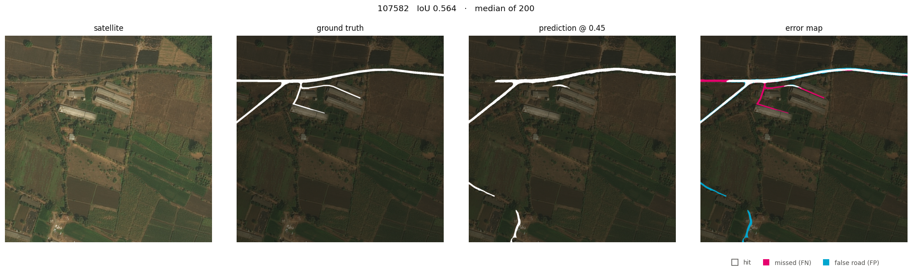
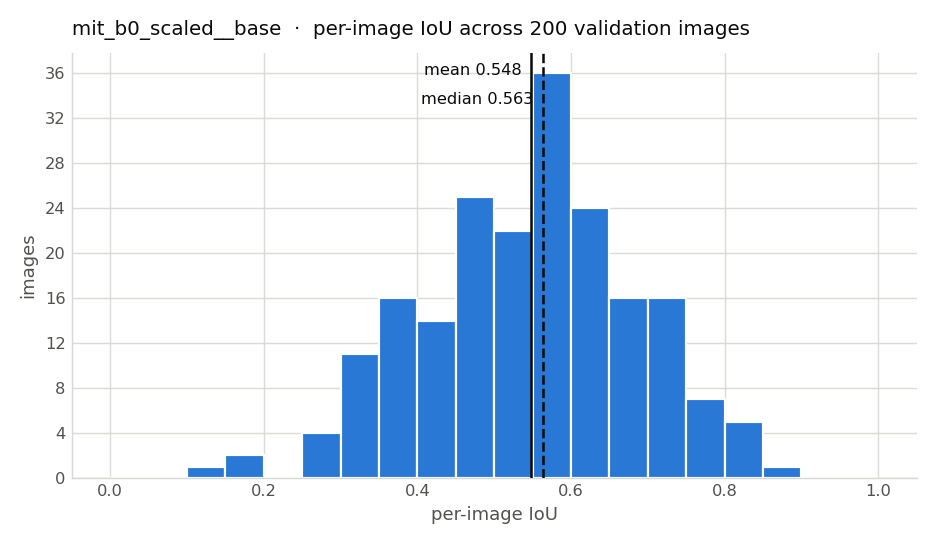
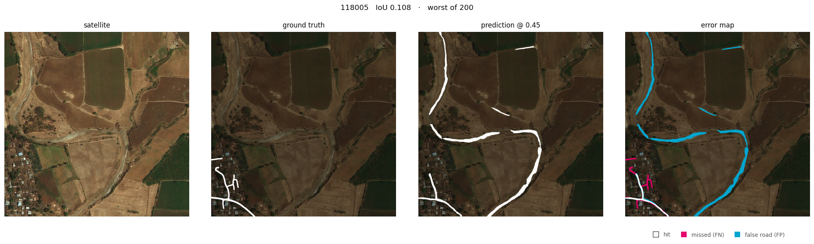
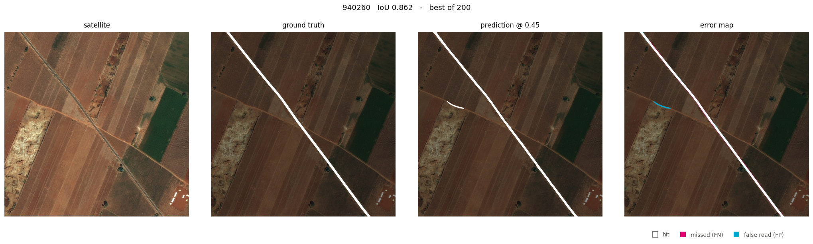
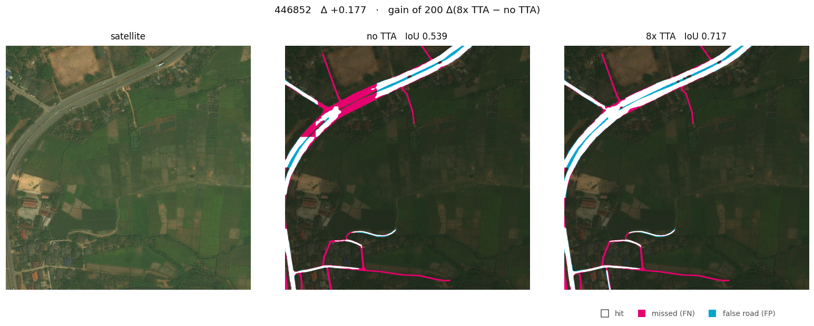
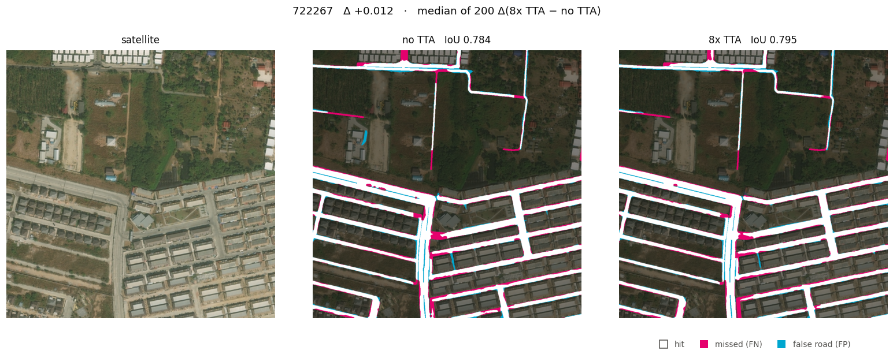
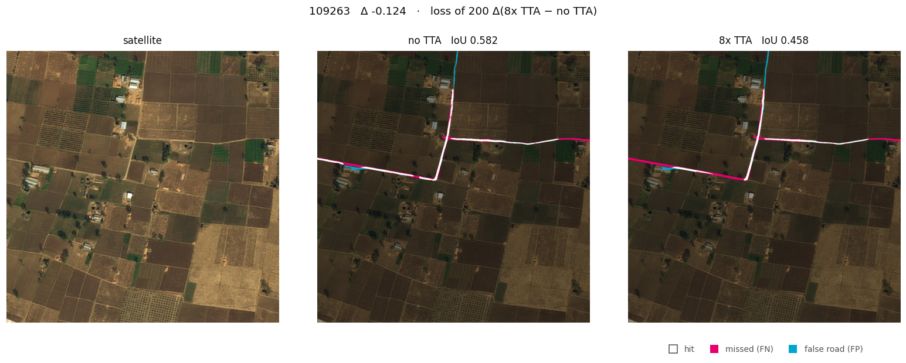
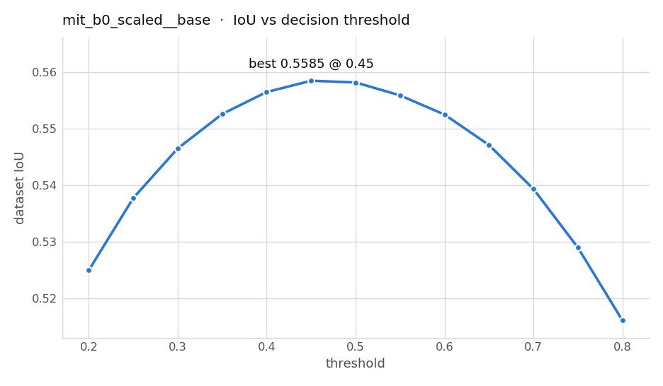

# Finding Roads from Space on a Free GPU

*A small-budget R&D report on the DeepGlobe road-extraction task — what moved the
number, what didn't, and why measuring carefully mattered more than modelling
cleverly.*

**TL;DR.** Starting from a 5.5M-parameter transformer U-Net, dataset IoU went
from 0.549 to **0.597** on 200 held-out 1024×1024 satellite tiles. The gains, in
order of size: 3× more training data (+0.026), test-time augmentation (+0.016,
measured properly), post-processing (+0.003), threshold tuning (+0.000). The most
valuable artifact wasn't any of those — it was learning *where the error
actually lives* (road-edge placement, not road detection) and building the
measurement discipline to attribute every delta to a single cause. Full
experiment-by-experiment history, including the wrong predictions, is in the
[logbook](LOGBOOK.md).

---

## 1. The task, and why it's sneaky

Given a 1024×1024 satellite tile (~0.5 m/pixel, rural Thailand, India and
Indonesia), label every road pixel. Binary segmentation — about as standard as
computer vision problems get. Two properties make it harder than the usual
segment-the-cat benchmark:

**Roads are thin.** A rural road here is maybe 12 pixels wide. The scoring
metric, IoU (intersection over union — overlap between predicted and true road
pixels), punishes boundary errors brutally on thin shapes: draw the road in
exactly the right place but 2 pixels too wide on each side, and you've already
lost ~30% IoU on that road. On a fat blob like a cat, the same 2-pixel fringe
would cost almost nothing.

**Roads are a network.** Downstream users (routing, mapping) care whether roads
*connect*. IoU counts pixels and is blind to connectivity — a prediction that's
slightly thick but unbroken and one that's perfectly thin but shattered at every
tree shadow can score identically. This gap between the metric and the goal
shapes several decisions below.

This project is also deliberate practice for a harder future problem: coronary
vessel segmentation in 3D cardiac CT. Vessels are the same problem class — thin,
elongated, sparse, connectivity-critical — with the same tile-predict-stitch
constraint (a 3D volume doesn't fit in GPU memory either). Roads are the
cheap rehearsal.

## 2. Ground rules

All experiments ran on Kaggle's free Tesla T4 (~30 GPU-hours/week), which forces
a useful discipline: every run must be *informative*, because runs are the
scarce resource.

**Data.** 6,226 labelled tiles (the official DeepGlobe validation and test sets
ship without public masks, so they can't be scored offline). 200 images are
carved out *first* with a fixed seed and used as validation in every single run;
training takes a prefix of the remainder. This means a run trained on 2,000
images and one trained on 6,026 are scored on the *same* 200 tiles, and the
bigger training set is a strict superset of the smaller — so both data-scaling
and model comparisons are clean.

**Metric.** Headline is **dataset IoU on full 1024px images**: accumulate
TP/FP/FN over all 200 images, divide once. (Averaging per-image IoU instead
lets near-empty tiles count as much as dense ones and reads systematically
lower; published numbers use dataset IoU.) Models train on 256px random crops
but are evaluated on whole images by sliding a window with overlap and averaging
the overlapping predictions.

**Noise floor.** Two runs of the *same* config don't produce the same number —
more on this in §6. Cross-run differences under ~0.02 are treated as
unconfirmed; paired comparisons on identical checkpoints are trusted down to a
few thousandths.

## 3. Picking a model: a fair fight at a fixed budget

First question: at an equal budget (2,000 images, 18 epochs, ~10 GPU-minutes),
does the road-specific architecture beat a small generic transformer?

The road-specific contender is **D-LinkNet** — winner of the original 2018
DeepGlobe challenge, a ResNet-34 encoder-decoder with dilated convolutions at
the bottleneck specifically so the receptive field spans a road crossing the
whole tile. The generic contender is a **U-Net with a MiT-B0 encoder** (the
SegFormer transformer backbone), 5.5M parameters.

| model | params | dataset IoU |
|---|---|---|
| U-Net + MiT-B0 | 5.5 M | 0.549 |
| D-LinkNet (ResNet-34) | 31.1 M | 0.540 |

The 0.009 gap is below the noise floor: **a tie on accuracy**. The real result
is that the generic transformer matched the purpose-built architecture with
**5.6× fewer parameters**. D-LinkNet was dropped; everything after this is
MiT-B0.

## 4. The data lever: real but exhausted

Both models plateaued by epoch ~14 (validation loss flat to four decimal
places), so more epochs weren't the constraint. Scaling training data from
2,000 to all 6,026 images: **0.549 → 0.575**, +0.026 for 3× the data and 3× the
train time. Real — it clears the noise floor — but clearly diminishing, and the
model plateaued again. Since 6,026 images is the *entire* labelled pool, the
data lever is now spent. Time to find out what the remaining 42% of error
actually is, rather than guessing at the next lever.

## 5. Look at your errors before spending GPU on them

A visualization pass (`src/visualize.py`) renders each validation image as
satellite / ground truth / prediction / error map, with the examples auto-picked
at the worst, median and best per-image IoU — never hand-chosen, so the figures
show honest behaviour rather than a flattering sample. Three findings, in order
of importance.

**Finding 1: the error is boundary placement, not detection.** Here is the
*median* image — dead-typical performance, IoU 0.564:

Every road is found. The topology is right. Look at the error map (right
panel): magenta (missed pixels) and cyan (false pixels) run *parallel along the
same road edges*. That signature means correct position, wrong width — and per
§1, thin structures make that expensive. The bulk of the missing IoU is edge
fuzz, not missing roads.

Part of that fringe is unfixable: DeepGlobe's ground-truth masks are
**fixed-width buffers drawn around road centrelines**, while real roads vary in
width. Some of the "error" is disagreement between an honest prediction and an
imprecise label — a ceiling no amount of training can pass.

**Finding 2: there is no failing sub-population.** The per-image IoU
distribution is one hump, not two:

Only 7 of 200 images fall below 0.3. This matters because it *kills* an entire
category of plausible-sounding work ("unpaved tracks probably fail as a class —
let's add an augmentation for them") before any GPU time is spent on it.

**Finding 3: the tail is semantic confusion.** The single worst image, IoU
0.108:

The model traces a dry riverbed — a pale, sinuous channel that genuinely
resembles a dirt track — while missing the faint real tracks in the village.
Interesting, but it's ~7 images; not where the score lives.

For contrast, the best image (IoU 0.862) is a paved highway on bare farmland —
high contrast, no distractors:

**The decision that followed:** attack boundary *noise*, at inference cost only.

## 6. Test-time augmentation: the one big free lunch

**The idea.** A square satellite tile has 8 symmetries (4 rotations × mirror).
Run the model on all 8 views, un-transform the 8 predictions back, average them
— test-time augmentation (TTA). The training augmentation already sampled
exactly these 8 symmetries, so every view is in-distribution. The mechanism:
boundary noise is largely uncorrelated between orientations, so averaging
cancels it, while the true road is identical in all 8 views and survives.

Bundled with denser sliding-window overlap, this moved the headline **0.575 →
0.597** — the largest single jump in the project. But the first measurement had
a flaw worth dwelling on, because fixing it became its own experiment.

**The measurement problem.** Training here is not bit-reproducible
(`cudnn.benchmark` trades determinism for speed), and two runs of an identical
config were observed to differ by **~0.005 dataset IoU** — bigger than several
of the effects being measured. Worse, the pipeline originally *always
retrained*, so measuring an inference-side change cost 31 GPU-minutes and
dragged that training lottery into every comparison. The +0.022 was really
TTA + overlap + luck, in unknown proportions.

**The fix** was boring and decisive: a standalone inference entry point
(`src/predict.py`) that loads one frozen checkpoint and re-scores it under any
inference settings. Comparisons become *paired* — same weights, same images,
one variable — trustworthy down to a few thousandths, and 3 minutes instead
of 31. The paired ablation:

| configuration | dataset IoU | Δ | inference time |
|---|---|---|---|
| no TTA, overlap 64 | 0.5413 | — | 17 s |
| no TTA, overlap 128 | 0.5422 | +0.0009 | 26 s |
| 8× TTA, overlap 128 | 0.5582 | **+0.0160** | 3 m 00 s |

**The gain is entirely TTA.** The denser tiling overlap — adopted a week
earlier on plausible-sounding reasoning ("more votes at tile seams") — is worth
+0.0009: nothing, for 1.5× inference time. It was reverted. A mechanism is not
a magnitude; this is why you ablate.

What does +0.016 actually look like? Side-by-side error maps, same frozen
weights, picked at the largest gain / median / largest loss of the per-image
delta:

*Best case (Δ +0.177): without TTA a whole section of divided highway is missed
(magenta block at the junction) — the single-view prediction sat marginally
below threshold. When 8 views vote, it's recovered. (The cyan stripe down the
highway median persists in both: the model reads the full corridor as road while
the label buffers each carriageway separately — a label-convention error, not a
model one.)*

*Typical case (Δ +0.012): the honest headline image. Both predictions find the
entire suburban grid; TTA just thins the boundary fringe. Squint required —
which is exactly what a +0.016 dataset-level effect looks like per image.*

*Worst case (Δ −0.124): averaging is a consensus mechanism, and consensus cuts
both ways. These faint field tracks were weak, barely-over-threshold detections
in a single view; averaged across 8 views they get vetoed (more magenta, not
less). TTA trades away rare weak positives to remove common boundary noise —
net strongly positive, but not uniformly so.*

## 7. The levers that did nothing (measured, not assumed)

**Threshold tuning: dead on arrival, five times.** The probability-to-binary
decision threshold was swept 0.20–0.80 on every run. It came back at or within
noise of the 0.50 default every time, buying at most +0.0003:

This isn't a broken sweep — an *under*-trained model is genuinely helped by a
raised threshold (verified on a 1-epoch smoke test). A converged model trained
with Dice-heavy loss is simply already calibrated. Negative result, high
confidence, zero remaining cost: the sweep now just documents itself.

**Post-processing: a units bug that turned out to hide nothing.** Morphological
cleanup (close small gaps, delete small blobs) initially did nothing, and the
suspected cause was embarrassing: its constants were sized for 256px crops but
applied to 1024px images — 16× too small by area. A 20-cell grid search at the
correct scale, run on saved predictions (CPU, free, perfectly paired), found the
best cell worth **+0.0028** — and the whole surface flat until the blob-size
floor starts eating real road stubs. The bug was real; the buried treasure
wasn't. In hindsight §5 predicted this: closing bridges gaps and deletes
islands, but this model's error is a parallel edge fringe. **Post-processing
was aimed at a failure mode this model doesn't have.** Adopted anyway (it's
free and non-negative); never touched again.

## 8. Process: predictions on the record

Every experiment's expected outcome was written in the
[logbook](LOGBOOK.md) *before* the run, then scored against reality. The
scorecard so far:

| prediction | predicted | measured | verdict |
|---|---|---|---|
| TTA + overlap bundle | +0.005 – 0.015 | +0.0217 | ❌ too conservative |
| post-proc at correct scale | "meaningful recovery" | +0.0028 | ❌ too optimistic |
| TTA alone (paired) | +0.010 – 0.018 | +0.0160 | ✅ |
| overlap alone (paired) | +0.002 – 0.005 | +0.0009 | ❌ too optimistic |

Half the point of pre-registering is that misses can't be quietly reframed as
"about what we expected." The other half: the *direction* of the misses is
informative. Both optimistic misses were mechanisms that sounded right but were
never isolated — the same trap, twice. The apparatus that ended it (frozen
checkpoints, paired scoring) was worth more than any single gain it measured.

## 9. Where it stands, and what's honestly unresolved

| milestone | dataset IoU |
|---|---|
| MiT-B0 U-Net, 2,000 images | 0.549 |
| all 6,026 images | 0.575 |
| + 8× TTA | **0.597** |

Published references on this dataset (full training, many more epochs): the
2018 D-LinkNet winner ~0.63–0.65, recent DeepLabV3+ variants 0.67–0.71. The gap
from 0.597 to 0.63 is mostly a budget gap, not an ideas gap — and DeepGlobe's
own label noise caps what any method can reach.

Open items, in order of importance:

1. **No true test set yet.** The same 200 images currently pick the best
   checkpoint, tune the threshold, and produce the headline — self-grading. The
   damage is provably small (the threshold "tuning" chose the default), but a
   200-image holdout untouched until all decisions freeze is the first thing a
   reviewer would demand, and it's the next scheduled change.
2. **Boundary-weighted loss** — the one untried lever aimed at where §5 showed
   the error actually is.
3. **Larger crop context** targets only the ~7-image riverbed tail; deliberately
   deprioritized despite being the obvious-looking move.
4. **Cross-dataset generalization** to CHN6-CUG (same 0.5 m/pixel resolution, so
   no resampling confound) — protocol pre-registered in
   [docs/protocols/cross-dataset-eval.md](protocols/cross-dataset-eval.md)
   before running anything.

**The transferable lesson** — for roads, for vessels, for any thin-structure
segmentation on a budget: the score improved by 0.05 total, and more than half
the project's *decisions* came from a CPU-only visualization pass and a
3-minute paired ablation harness. Look at your errors before buying levers, and
make your measurements paired before trusting them.

## 10. Reading list

Is the approach above how the field would do it? **No — and the gaps are
specific.** This pipeline trains on 256px crops where the strong results train
at or near full resolution; its loss is purely per-pixel while the best
DeepGlobe numbers come from connectivity-aware architectures and losses; it
outputs pixel masks where an entire branch of the literature outputs road
*graphs* directly; and it scores only IoU where serious road work also reports
a topology metric (APLS). Each gap has a subsection below. What this project
does share with good practice is the boring part: fixed splits, paired
ablations, and error analysis before lever-pulling — nnU-Net (last subsection)
is the famous argument that this boring part is most of what matters.

### The dataset and the challenge

- **Demir et al., "DeepGlobe 2018: A Challenge to Parse the Earth through
  Satellite Images," CVPR Workshops 2018** (arXiv:1805.06561). The source of
  this dataset: task definitions, the dataset IoU metric used here, and the
  baseline numbers everyone compares against. Read first.
- **Mnih & Hinton, "Learning to Detect Roads in High-Resolution Aerial
  Images," ECCV 2010.** The prehistory — roads from aerial imagery with neural
  networks a decade before it was easy, introducing the Massachusetts Roads
  dataset (this repo's accidental namesake). Notable for worrying about noisy
  labels back then already; §5's label-buffer ceiling is the same issue.
- **Zhu et al., "A Global Context-Aware and Batch-Independent Network for Road
  Extraction from VHR Satellite Imagery," ISPRS Journal of Photogrammetry and
  Remote Sensing 2021.** Introduces **CHN6-CUG**, the 0.5 m/pixel urban-China
  dataset that §9's cross-dataset experiment targets.

### Road extraction on DeepGlobe — how the experienced handled it

- **Zhou, Zhang & Wu, "D-LinkNet: LinkNet with Pretrained Encoder and Dilated
  Convolution for High Resolution Satellite Imagery Road Extraction," CVPR
  Workshops 2018.** The challenge winner, reimplemented in this repo (§3). Short
  and readable; the dilated-bottleneck reasoning is a masterclass in designing
  for a specific failure mode (receptive field vs. tile-spanning roads). Builds
  on **Chaurasia & Culurciello, "LinkNet," VCIP 2017** (arXiv:1707.03718).
- **Wang, Seo & Jeon, "NL-LinkNet: Toward Lighter but Accurate Road Extraction
  with Nonlocal Operations," IEEE GRSL 2021** (arXiv:1908.08223). Beat
  D-LinkNet on DeepGlobe with *fewer* parameters by adding non-local (global
  attention) blocks — the same "long-range context beats brute size" bet that
  made MiT-B0 competitive in §3.
- **Mei et al., "CoANet: Connectivity Attention Network for Road Extraction
  from Satellite Imagery," IEEE TIP 2021.** Among the strongest published
  DeepGlobe results. Explicitly supervises *connectivity* between neighbouring
  pixels along road directions — attacking exactly the metric-vs-goal gap
  described in §1 instead of hoping pixel loss handles it.
- **Batra et al., "Improved Road Connectivity by Joint Learning of Orientation
  and Segmentation," CVPR 2019.** Multi-task learning: predict road
  *orientation* alongside the mask, and connectivity improves. A cheap-ish idea
  this pipeline could actually adopt.

### Roads as graphs, not pixels

A whole branch of the field argues segmentation is the wrong output format —
downstream users want a routable network, so predict *that*.

- **Bastani et al., "RoadTracer: Automatic Extraction of Road Networks from
  Aerial Images," CVPR 2018** (arXiv:1802.03680). Iteratively *walks* the road
  network with a CNN deciding where to step next. No mask anywhere.
- **He et al., "Sat2Graph: Road Graph Extraction through Graph-Tensor
  Encoding," ECCV 2020** (arXiv:2007.09547). One-shot graph prediction via a
  clever tensor encoding; the reconciliation of the two philosophies.
- **Van Etten et al., "SpaceNet: A Remote Sensing Dataset and Challenge
  Series," arXiv:1807.01232.** Home of **APLS** (Average Path Length
  Similarity), the graph metric that scores what IoU can't: whether predicted
  routes actually connect. If this project gets one more metric, it's APLS.

### Losses and metrics for thin structures

The most transferable subsection — every paper here applies verbatim to the
vessel-segmentation end goal.

- **Mosinska et al., "Beyond the Pixel-Wise Loss for Topology-Aware
  Delineation," CVPR 2018** (arXiv:1712.02190). The clearest statement of §1's
  problem — per-pixel losses are blind to topology — plus a practical fix using
  pretrained-network features.
- **Shit et al., "clDice — a Novel Topology-Preserving Loss Function for
  Tubular Structure Segmentation," CVPR 2021** (arXiv:2003.07311). Dice
  computed on soft *skeletons*, rewarding centreline correctness over width
  correctness. Given §5's finding that this model's error is almost entirely
  width, this is arguably the single most relevant paper in the list — and it's
  framed around vessels.
- **Kervadec et al., "Boundary Loss for Highly Unbalanced Segmentation," MIDL
  2019** (arXiv:1812.07032). The strongest candidate for open item #2 in §9: a
  distance-map-weighted loss that concentrates gradient where §5 located the
  error.
- **Hu et al., "Topology-Preserving Deep Image Segmentation," NeurIPS 2019.**
  The rigorous end: a persistent-homology loss with actual guarantees. Heavier
  reading; skim for the framing even if the math is a stretch.
- **Milletari et al., "V-Net," 3DV 2016** (arXiv:1606.04797). Where Dice loss
  (the `bce_weight: 0.3` counterweight in this repo, §7) comes from, and why it
  exists: class imbalance.

### Backbones and pipeline craft

- **Ronneberger et al., "U-Net," MICCAI 2015** (arXiv:1505.04597). The decoder
  used everywhere in this repo; read for *why* skip connections preserve the
  fine detail that thin structures need.
- **Xie et al., "SegFormer: Simple and Efficient Design for Semantic
  Segmentation with Transformers," NeurIPS 2021** (arXiv:2105.15203). Source of
  the MiT-B0 encoder that won §3; the efficiency argument made there predicted
  that result.
- **Chen et al., "DeepLabV3+," ECCV 2018** (arXiv:1802.02611). Backbone of the
  current top DeepGlobe numbers; atrous (dilated) convolution is the same trick
  D-LinkNet borrowed.
- **Isensee et al., "nnU-Net: A Self-Configuring Method for Deep
  Learning-Based Biomedical Image Segmentation," Nature Methods 2021.** The
  famous demonstration that a *plain* U-Net with disciplined preprocessing,
  augmentation and evaluation beats most architectural novelty. The closest
  thing this project's philosophy has to a citation — and the standard to beat
  in the CCTA domain this project is heading toward.

---

*Figures in §5–7 come from the 2,000-image ablation checkpoint (IoU 0.562), not
the 0.597 headline run — the paired TTA comparison requires the frozen
checkpoint, and the qualitative behaviour is identical at both scales. All
figures are auto-selected (worst/median/best or min/median/max delta), never
hand-picked. Numbers: `outputs/results/*.json`, regenerated by the commands in
the [README](../README.md).*
